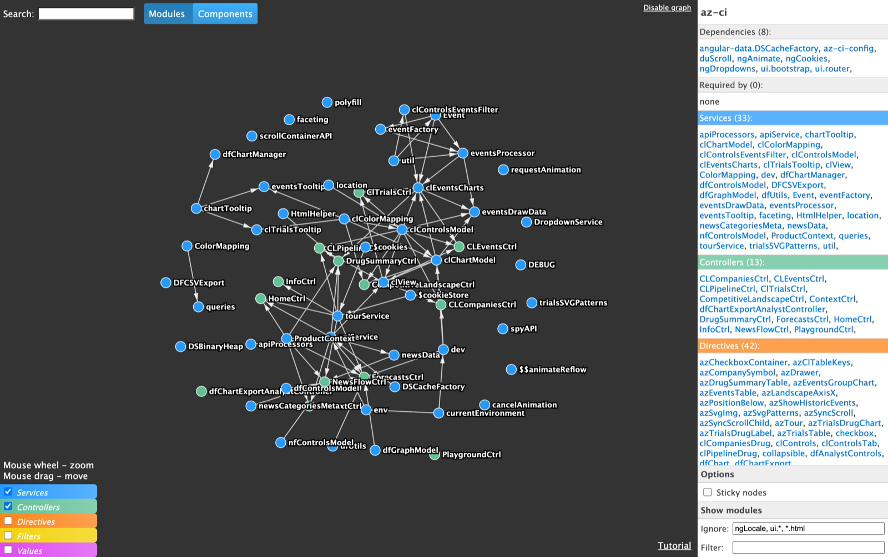

# AngularJS dependency graph

[](https://github.com/filso/ng-dependency-graph/actions/workflows/ci.yml)
[](https://chrome.google.com/webstore/detail/angularjs-dependency-grap/gghbihjmlhobaiedlbhcaellinkmlogj)

Chrome DevTools extension that visualises the module and component dependency graph of an AngularJS (1.x) app.
Open any page running AngularJS, switch to the **AngularJS Graph** panel in DevTools and explore how modules,
services, controllers, directives and filters depend on each other.



**[Live demo](https://filso.github.io/ng-dependency-graph/)** (runs on bundled sample data)

## Features

- Interactive D3 force-directed graph with zooming, panning and sticky nodes
- Modules view and components view (services, controllers, directives, filters, values)
- Info panel with dependencies and reverse dependencies ("required by") of the selected node
- Fuzzy search across all modules and components
- Ignore / filter modules with wildcard masks (e.g. `ngLocale, ui.*`)
- Graph updates on page reload; settings are persisted per project
- Works with apps bootstrapped asynchronously via `angular.bootstrap`
- Scope inspector pane in the Elements tab

## Installing

### From the Chrome Web Store

[AngularJS dependency graph](https://chrome.google.com/webstore/detail/angularjs-dependency-grap/gghbihjmlhobaiedlbhcaellinkmlogj)

### From source

1. Clone the repository: `git clone https://github.com/filso/ng-dependency-graph`
2. Navigate to `chrome://extensions` and enable Developer Mode.
3. Choose "Load unpacked" and select the cloned directory.

No build step is required — the extension runs straight from the checkout.

## Development

The app is plain AngularJS 1.4 + D3 v3, loaded as script files with no bundler.

```bash
npm install     # dev tooling only (tests, lint, format)
npm start       # serve the panel at http://localhost:8123 in demo mode (sample data)
npm test        # run unit tests (vitest)
npm run lint    # eslint
npm run format  # prettier
npm run package # build ng-dependency-graph.zip for the Chrome Web Store
```

Outside the extension context the app loads bundled sample data, so most UI work can be
done in a normal browser tab. To exercise the real DevTools flow, load the unpacked
extension and inspect a page running AngularJS.

### How it works

- `app/scripts/inject/inject.js` — content script; when the opt-in cookie is set it injects
  code into the inspected page that walks `angular.module(...)._invokeQueue` and exposes
  dependency metadata on `window.__ngDependencyGraph`.
- `app/devtoolsBackground.js` — registers the DevTools panel and the Elements sidebar pane.
- `app/scripts/` — the AngularJS app rendering the graph (models, D3 directive, info panel,
  search, tour).

## License

MIT
